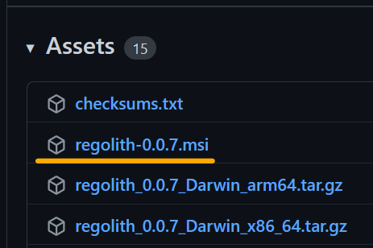
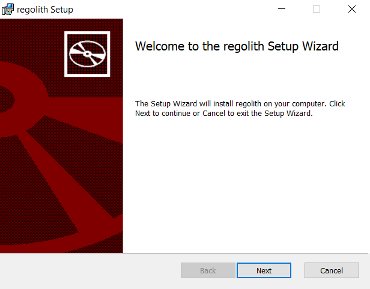
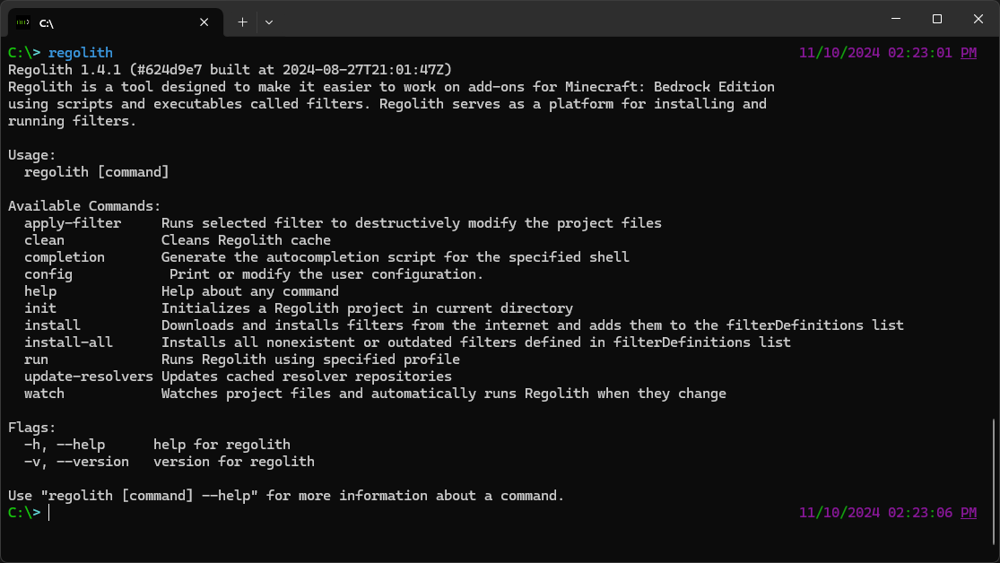

(installation)=
# Installation
You can install Regolith using various methods, depending on your operating system. This section provides instructions for installing Regolith on Linux, Mac, and Windows systems.

## Winget (Windows)
To install Regolith using winget, open a command prompt or terminal window and enter the following command:
```
winget install Bedrock-OSS.regolith
```
This will search the winget repository for the "Bedrock-OSS.regolith" package and install it on your system. If the installation is successful, you should see a message indicating that the package has been installed.

To update Regolith in the future, simply run the following command:
```
winget upgrade Bedrock-OSS.regolith
```
This will check for any available updates to the Regolith package and install them on your system.

```{warning}
Not every Windows computer has winget installed. If this is the case for your computer, you can install Regolith using the MSI file available on GitHub (see next section for instructions).
```

## MSI File (Windows)

You can install Regolith using the MSI file available on the release page on GitHub: [https://github.com/Bedrock-OSS/regolith/releases/latest](https://github.com/Bedrock-OSS/regolith/releases/latest)




The MSI file name follows the pattern `regolith-x.x.x.msi`, where `x.x.x` is the version number. Simply download the MSI file from the link above and run it to begin the installation process. Follow the prompts to complete the installation.



## Updating (Windows)

To update Regolith after installation, you can use the "regolith-update.ps1" PowerShell script that is included with the installation. To run the script, follow these steps:

1. Open a PowerShell window.
2. Run the following command:

```
regolith-update.ps1
```

This will check for any available updates to Regolith and install them on your system.

## Stand-alone Executable File (Linux, Mac, and Windows)

Regolith can also be installed stand-alone. Simply download the correct zip for your operating system from the release page on GitHub: [https://github.com/Bedrock-OSS/regolith/releases/latest](https://github.com/Bedrock-OSS/regolith/releases/latest)

For Windows, this is most likely `regolith_x.x.x_Windows_x86_64.zip`.


Unzip this package, and place the Regolith executable file somewhere convenient. In stand-alone mode, you will need a add the executable to your PATH environment variable or copy it into every project.

## Checking Installation

After installing, Regolith can be used in command-prompt by typing `regolith`. You should see something like this:



```{note}
If you don't see this try restarting your terminal. If you encounter any issues, please refer to the {ref}`troubleshooting guide<troubleshooting>` for tips.
```